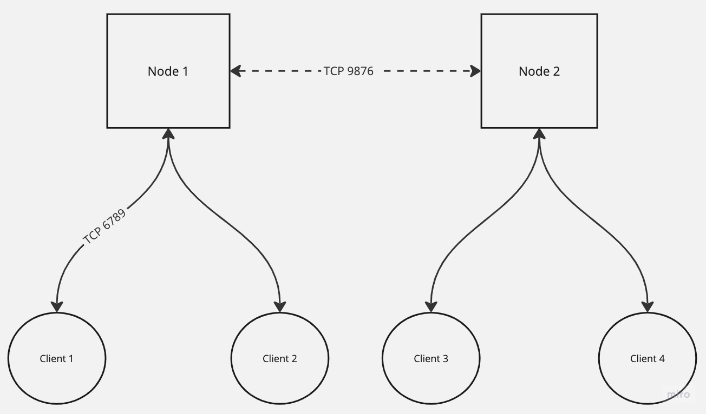

# Vayeate

a distributed message broker

## Environment

> all environment variable names should be prefixed with VAYEATE_

| Name              | Default           | Required | Description                                                  |
|-------------------|-------------------|----------|--------------------------------------------------------------|
| `CLIENT_PORT`     | `6789`            | `true`   | the port clients will connect to                             |
| `PEER_PORT`       | `9876`            | `true`   | the port peers will connect to                               |
| `API_PORT`        | `8080`            | `true`   | the port to listen on for http                               |
| `USERNAME`        | `admin`           | `true`   | the authentication username                                  |
| `PASSWORD`        | `admin`           | `true`   | the authentication password                                  |
| `PRIMARY_ADDRESS` |                   | `false`  | the primary node address (only set if the node is secondary) |
